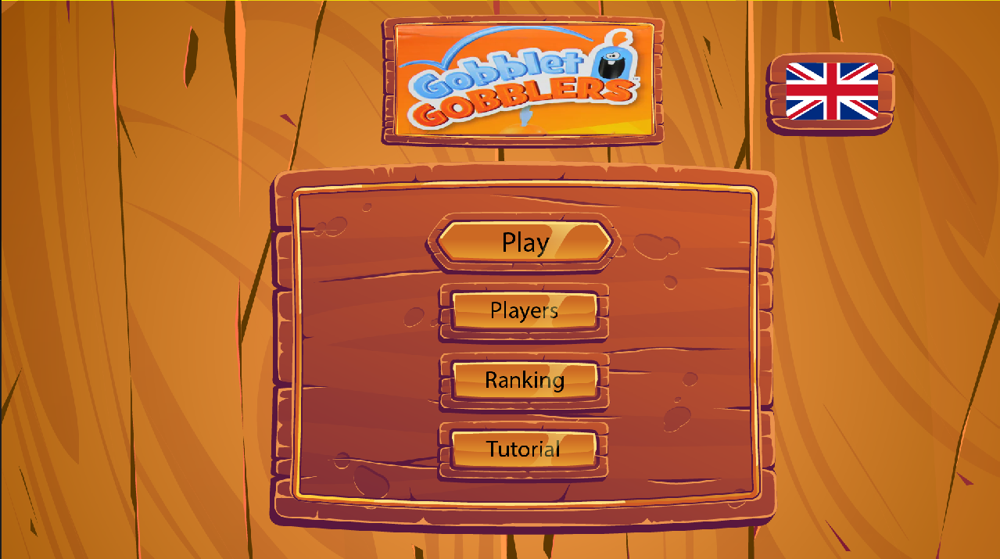
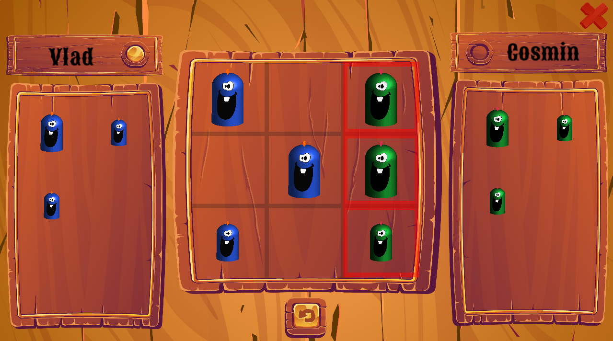

# Gobblet Gobblers

A desktop implementation of the board game **Gobblet Gobblers**, written in C++ with
[SFML](https://www.sfml-project.org/). Built as a university project for the
*Faculty of Computer Science (FII), "Alexandru Ioan Cuza" University of Iași (UAIC)*.

Gobblet Gobblers is tic-tac-toe with a twist: pieces come in three sizes, and a
bigger piece can **gobble** (cover) a smaller one — even your opponent's. Get three
of your colour in a row, but watch out: lifting a piece can suddenly uncover an
opponent's piece and hand them the win.

<p align="center">
  
  
</p>

## Features

- 🎮 **Local 2-player** matches on a 3×3 board with three nesting piece sizes.
- 🤖 **AI opponent** with two difficulties (Easy / Hard) driven by a recursive
  minimax search.
- 👤 **Player profiles** with persistent **win/loss records** and an in-game
  **leaderboard** (*Clasament*).
- 💾 **Save & continue** — an in-progress game is stored to disk and can be resumed.
- 🌍 **Bilingual UI** — switch between **Romanian** and **English** at any time.
- 🔊 **Sound & music** — click/move/eat/win sound effects plus menu and in-game music.
- 📖 In-game **tutorial** screen explaining the rules.

## Tech stack

- **Language:** C++
- **Graphics / audio / windowing:** SFML 2.x (vendored under `Gobblet Gobblers/External/SFML`)
- **Build system:** Visual Studio solution (`.sln` / `.vcxproj`), MSBuild, toolset v142

## Building & running

This is a Visual Studio project. SFML is bundled in the repo, so no separate
SFML installation is required.

1. Install **Visual Studio 2019 or newer** with the *Desktop development with C++*
   workload (the project targets the **v142** toolset).
2. Clone the repository and open `Gobblet Gobblers/Gobblet Gobblers.sln`.
3. Select the **`Debug` / `x86` (Win32)** configuration — the bundled SFML import
   libraries are 32-bit.
4. Build and run (**F5**). The SFML runtime DLLs already sit next to the project,
   and the game loads its sprites, fonts and audio from the `assets/` folder using
   relative paths, so it runs straight from the IDE.

> The working directory matters: the game reads `assets/...` relative to where it
> runs. When launched from Visual Studio this resolves correctly. If you run the
> built `.exe` directly, make sure the `assets/` folder and the SFML DLLs are
> alongside it.

## How to play

- From the main menu you can start a new game, continue a saved game, manage
  profiles, view the leaderboard, read the tutorial, or switch language.
- Pick a free piece from your side (or pick up one already on the board) and place
  it on a cell. A larger piece may be dropped on top of a smaller one to gobble it.
- The first player to line up three of their visible pieces — horizontally,
  vertically or diagonally — wins.

## Project structure

```
.
├── Gobblet Gobblers/
│   ├── Gobblet Gobblers.sln        # Visual Studio solution
│   ├── External/SFML/              # Vendored SFML headers + import libraries
│   └── Gobllet/
│       ├── main.cpp                # Game source (single translation unit)
│       ├── Gobllet.vcxproj         # Project file
│       ├── assets/                 # Sprites, fonts, audio, saved data
│       └── *.dll                   # SFML runtime libraries
├── Icon.ico                        # Application icon
├── LICENSE
└── README.md
```

> Note: the source code (variable and function names, comments) is written in
> **Romanian**.

## License

This project is released under the [MIT License](LICENSE).

SFML is bundled for convenience and is distributed under its own
[zlib/png license](https://www.sfml-project.org/license.php). Game assets
(fonts, sound effects, music) remain the property of their respective owners.
